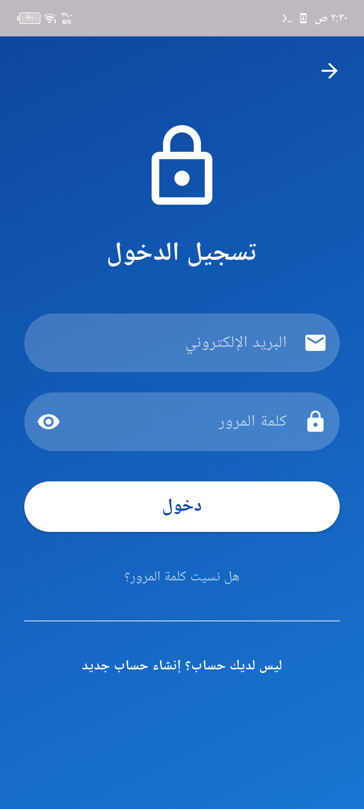
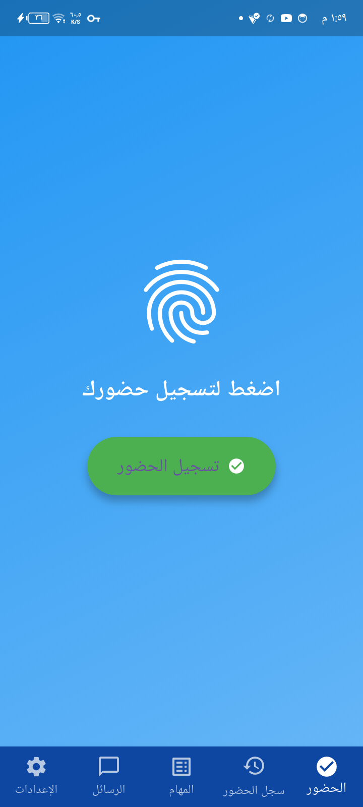
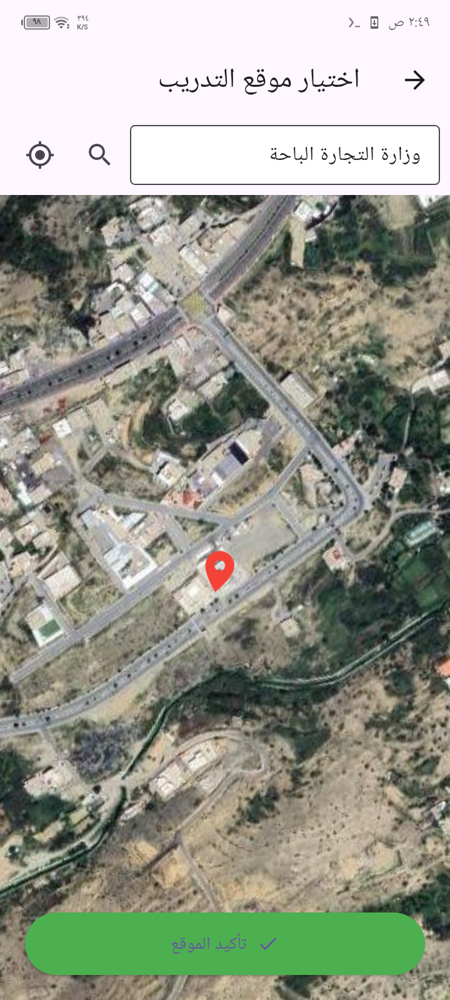
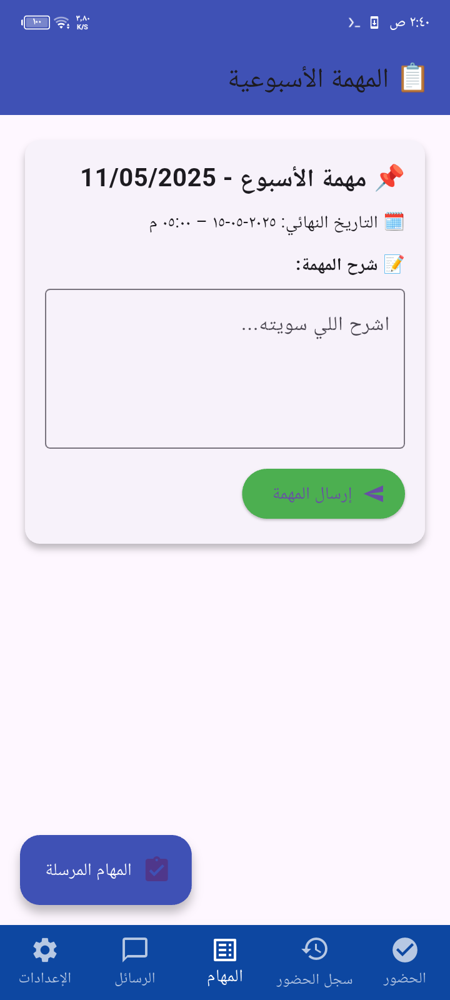
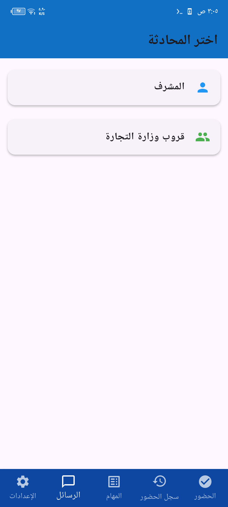
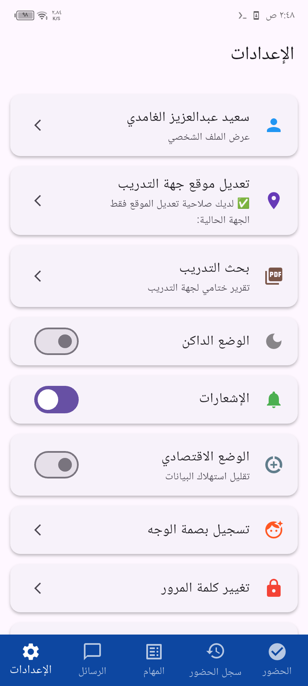
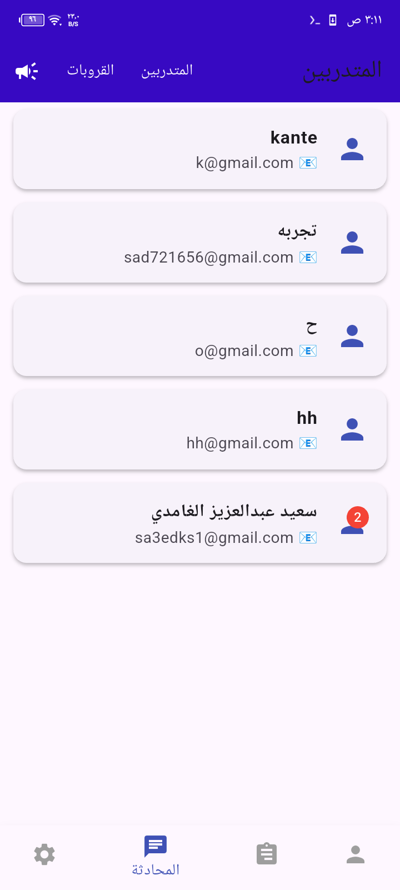

# SmartTrack - نظام التدريب الذكي 🎓📍

تطبيق ذكي شامل لإدارة التدريب الميداني، يتيح للمتدربين تسجيل الحضور ببصمة الوجه والموقع الجغرافي، وتسليم المهام الأسبوعية إلكترونيًا، مع نظام تواصل مباشر مع المشرفين، ولوحة تحكم متقدمة لتقييم الأداء واستعراض التقارير.  
هذا المشروع قُدِّم ضمن متطلبات التخرج من الكلية التقنية، ويجري تطويره ليكون منتجًا فعليًا يمكن تطبيقه واعتماده في الكليات والجامعات السعودية.

---

## 🎯 الفئة المستهدفة

- طلاب وخريجو الكليات التقنية أثناء فترة التدريب الميداني  
- مشرفو التدريب في الكليات وجهات التدريب

---

## ⚙️ المزايا الأساسية

- **توثيق حضور آمن:** باستخدام بصمة الوجه والموقع الجغرافي  
- **تسليم المهام إلكترونيًا:** مع إمكانية التقييم وإعادة الفتح  
- **نظام رسائل فوري:** بين المتدرب والمشرف، وبين المشرف وجهة التدريب  
- **تقارير شاملة:** أسبوعية، شهرية، ونهائية بصيغة PDF  
- **تنبيهات فورية:** عند التأخير أو وصول المهام  
- **لوحة تحكم للمشرف:** لمتابعة الأداء والتقييم والتقارير

---

## 🛠️ التقنيات المستخدمة

- Flutter + Dart  
- Firebase (Auth, Firestore, Storage, Cloud Messaging)  
- Face++ API  
- Google Maps & Geolocation  
- GitHub Actions (نشر اختياري)

---

# SmartTrack – The Intelligent Training System 🎓📍

A comprehensive smart application for managing field training. It allows trainees to log attendance using facial recognition and geolocation, submit weekly tasks electronically, communicate directly with supervisors, and includes a dashboard for performance tracking and smart reporting.  
Originally developed as a graduation project, SmartTrack is now being enhanced to be offered as a real solution for colleges and universities in Saudi Arabia.

---

## 🎯 Target Audience

- Technical college students and graduates in field training  
- Supervisors at colleges and training institutions

---

## ⚙️ Key Features

- **Secure Attendance:** Face recognition + Geolocation verification  
- **Weekly Tasks:** Electronic submission with grading & feedback  
- **Instant Messaging:** Between trainee and supervisor, or supervisor and training provider  
- **Reports:** Auto-generated weekly, monthly, and final PDF reports  
- **Notifications:** For delays or task updates  
- **Supervisor Dashboard:** To evaluate and monitor trainee performance

---

## 🛠️ Technologies Used

- Flutter + Dart  
- Firebase (Auth, Firestore, Storage, Cloud Messaging)  
- Face++ API  
- Google Maps & Geolocation  
- GitHub Actions (optional deployment)

---

## 📱 صور من التطبيق | Screenshots

> كل صورة تمثل ميزة مهمة في التطبيق، موضّحة بالعربي والإنجليزي 👇

---

### 🔐 شاشة تسجيل الدخول | Login Screen  
واجهة دخول المتدرب أو المشرف عبر البريد الإلكتروني وكلمة المرور  
**Login screen for trainees and supervisors using email and password**

---

### 🎭 تسجيل بصمة الوجه | Face Registration  
أول مرة يتم فيها تسجيل وجه المتدرب لربطه بالحضور  
**First-time face registration for attendance validation**

---

### 🕘 تسجيل الحضور | Attendance  
واجهة الضغط على زر الحضور والتحقق من الوجه والموقع  
**Attendance screen verifying face and geolocation**

---

### 🗺️ تحديد موقع جهة التدريب | Training Location  
خريطة لتحديد موقع التدريب الفعلي لأول مرة  
**Map interface to set training location**

---

### 📅 سجل الحضور | Attendance Log  
يعرض الأيام التي تم تسجيل الحضور فيها  
**Shows attendance days and timestamps**

---

### 📋 المهام الأسبوعية | Weekly Tasks  
شاشة المهام المرسلة أسبوعيًا من جهة التدريب  
**Weekly tasks assigned and submitted**

---

### 💬 اختيار المحادثة | Select Chat  
المتدرب يختار المحادثة بين مشرف التدريب أو الجهة  
**Trainee selects chat with supervisor or training group**

---

### ⚙️ الإعدادات | Settings  
ضبط الحساب والمعلومات والتقارير وبيانات جهة التدريب  
**App settings, final reports, and training organization info**

---

### 👨‍💼 لوحة تحكم المشرف | Supervisor Dashboard  
يعرض بيانات جميع المتدربين المرتبطين بالمشرف  
**Supervisor’s dashboard to monitor all trainees**

---

### 💬 محادثة المشرف مع المتدرب | Supervisor Chat  
إمكانية التواصل الفردي مع كل متدرب  
**Private chat between supervisor and trainee**

---

### 📈 إحصائيات المتدربين | Trainee Statistics  
يعرض عدد الحضور، المهام، والتقييمات  
**Trainee statistics and performance metrics**

---

### 📑 تقارير المشرف | Supervisor Reports  
واجهة تصدير تقارير الحضور أو المهام  
**Supervisor report export for attendance and tasks**

---

### ⚠️ تأكيد الحضور من الجهة | Attendance Approval  
المشرف يؤكد وجود المتدرب فعليًا داخل الجهة  
**Supervisor approves trainee presence on-site**

